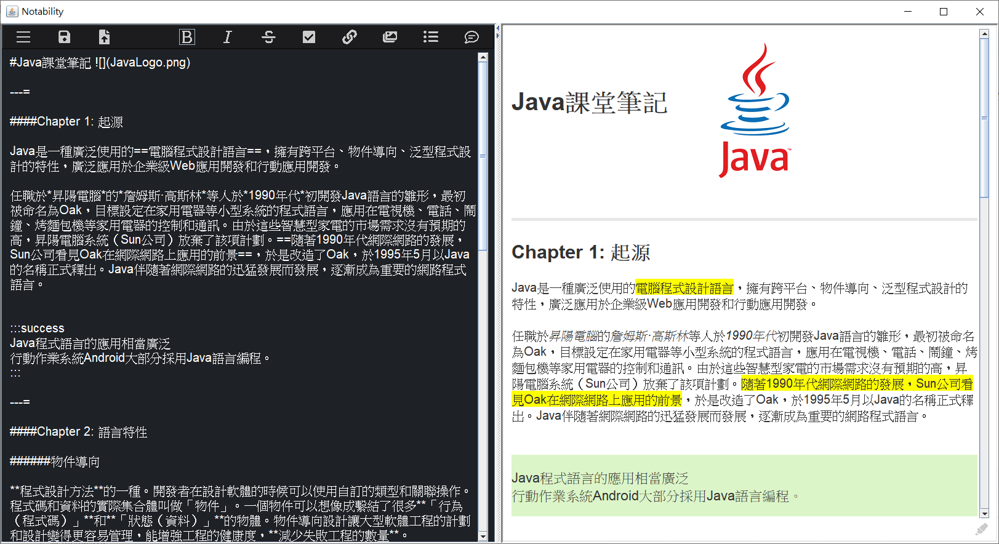

# JavaFinalProject
Java final project in 2020 Spring

## 語法介紹

```
# text                          :   標題
1. text                         :   有序清單
-  text                         :   無序清單
- [] item                       :   代辦事項
> text                          :   引用
**text**                        :   粗體
*text*                          :   斜體
~~text~~                        :   刪除線
H~2~O                           :   下標
==text==                        :   標記文字
- text =                        :   分隔線
[link text](https:// "title")   :   超連結
  :   圖片
```code```                      :   程式碼區塊

:::info text 
text                            :   區塊(info,warning,success,danger)
:::

```

## 介面操作



上方按鈕從左到右依序為:<br>
開啟工作室、存檔、載入檔案、<br>
粗體、斜體、刪除線、代辦事項、超連結、圖片、無序清單、引用<br><br>

右下方可以使用螢光筆功能，直接在右方視窗標記文字<br>

